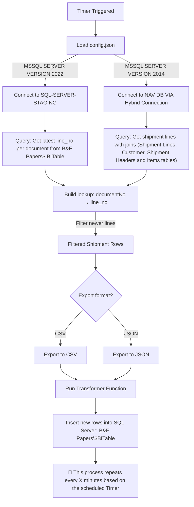

## options

1. SQL Server AGENT 
2. Azure functions

```mermaid

graph TD;
    TimerTrigger[Timer Triggered]
    TimerTrigger --> Init[Load config.json]
    Init -->|MSSQL SERVER VERSION 2022 | sql-server[Connect to SQL-SERVER-STAGING]
    Init -->|MSSQL SERVER VERSION 2014 | nav-server[Connect to NAV DB VIA Hybrid Connection]
    
    sql-server --> GetLatest[Query: Get latest line_no per document from B&F Papers$ BITable]
    nav-server --> GetShipments["Query: Get shipment lines with joins (Shipment Lines, Customer, Shipment Headers and Items tables)"]

    
    GetLatest --> Filter[Build lookup: documentNo → line_no]
    GetShipments --> Filter
    Filter -->|Filter newer lines| FilteredData[Filtered Shipment Rows]

    FilteredData --> Decision{Export format?}
    Decision -- CSV --> ExportCSV[Export to CSV]
    Decision -- JSON --> ExportJSON[Export to JSON]
    
    ExportCSV --> Transformer[Run Transformer Function]
    ExportJSON --> Transformer
    Transformer --> InsertNewRows["Insert new rows into SQL Server: B&F Papers\$BITable"]
    InsertNewRows --> LoopBack["🔁 This process repeats every X minutes based on the scheduled Timer"]

```